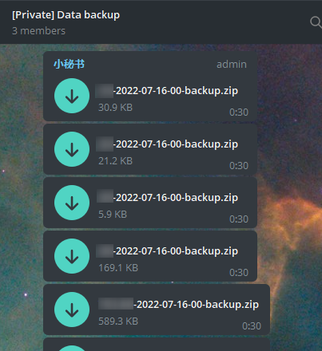

# AutobackupBot
定时任务自动备份指定文件夹 打压缩包并通过 telegram api 发送到指定对话。 
<br><br>

## 主要引用
|引用|说明|
|:-|:-:|
|Quartz.net|定时任务|
|log4net|日志|
|SharpZipLib|文件压缩|
<br>

## 起因
之前做的机器人放服务器上，数据库用的sqlite，心大没有做备份也没有注重服务器安全，后来某天服务器被黑，中了勒索病毒，所有文件全部被锁。导致机器人的库文件、配置文件甚至是日志文件也全都被锁，尝试恢复无果...导致机器人停摆几天，损失了一些用户。

故此做出这么个玩意儿。想使程序尽量精简不要太多依赖，没有引入telegram bot相关的包，发送消息和文件都是直接请求 telegram bot api来发送。 Quartz其实也挺厚重的,, 只不过之前写的机器人用的也是Quartz. 就懒得换了直接拿来用。
<br><br>

## 说明
指定文件夹配置：<br>
App_Data 目录 ```file.dll``` 文件，文本编辑器打开，配置内容格式：<br>
```
文件名前缀|文件夹路径
文件名前缀|文件夹路径
文件名前缀|文件夹路径
```

前缀与文件夹路径中间用 ```|``` 隔开，每行配置一个。

## 截图
